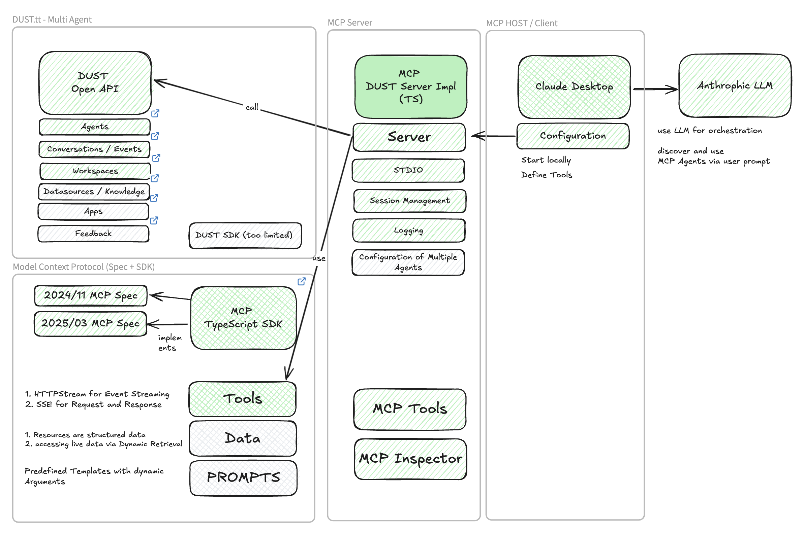

# Dust Agent MCP Server

A Model Context Protocol (MCP) server for document processing and analysis, designed to work with Claude Desktop via STDIO transport.

## Setup and Configuration

### Prerequisites

- Node.js v18+
- npm

### Installation

```bash
# Clone the repository
git clone https://github.com/Ma3u/dust-mcp-server.git
cd dust-mcp-server

# Install dependencies
npm install

# Build the project
npm run build

# Start the server
npm start
```

### Using MCP Tools

This project uses [MCP Tools](https://github.com/f/mcptools) for testing and integration. Here's how to use them:

1. Install MCP Tools globally

```bash
npm install -g mcptools
```

2. List available tools in the server

```bash
mcp tools node build/index.js
```

3. Call a specific tool

```bash
mcp call list_dust_agents node build/index.js --params '{"limit": 10}'

mcp call query_dust_agent node build/index.js --params '{"query": "Give me a summary"}'
```

4. Add the server to your aliases

```bash
mcp alias add query node build/index.js
mcp alias list
```

5. Configure with Claude Desktop

```bash
mcp configs set claude-desktop dust /path/to/node /path/to/dust-mcp-server/build/index.js
```

## Available MCP Tools

The server provides the following MCP tools for document management and analysis via the Dust.tt platform:

### `list_dust_agents`

Lists available Dust agents.

**Parameters:**

- None

**Returns:**

- List of available Dust agents

### `query_dust_agent`

Queries a Dust agent with context from processed documents.

**Parameters:**

- `agentId` (string, required): ID of the Dust agent to query
- `query` (string, required): The prompt or question to send to the agent
- `documentIds` (string[], optional): IDs of processed documents to include as context
- `context` (object, optional): Optional additional context data to provide to the agent
- `conversationId` (string, optional): Optional conversation ID for continuing an existing conversation

**Returns:**

- Agent's response to the query with relevant insights

### `upload_document`

Uploads a document (PDF or image) for storage and future processing.

**Parameters:**

- `fileContent` (string, required): Base64-encoded content of the file
- `fileName` (string, required): Name of the file including extension
- `fileType` (string, required): Type of document (e.g., "report", "correspondence", "data_analysis", "general")
- `description` (string, optional): Additional description of the document

**Returns:**

- Document ID and metadata for the uploaded file

**Example:**

```bash
mcp call upload_document node build/index.js --params '{"fileContent": "base64-encoded-content", "fileName": "report.pdf", "fileType": "report", "description": "Quarterly analysis report"}'
```

### `list_documents`

Lists all uploaded documents with optional filtering.

**Parameters:**

- `fileType` (string, optional): Filter by document type ("report", "correspondence", "data_analysis", "general", "all")
- `limit` (number, optional): Maximum number of documents to return
- `sortBy` (string, optional): Field to sort by (e.g., "uploadDate", "fileName", "fileSize")

**Returns:**

- List of document IDs and metadata

**Example:**

```bash
mcp call list_documents node build/index.js --params '{"fileType": "report", "limit": 10, "sortBy": "uploadDate"}'
```

### `process_document`

Processes a previously uploaded document to extract and structure its information.

**Parameters:**

- `documentId` (string, required): ID of the document to process

**Returns:**

- Processing status and extracted information based on document type

**Example:**

```bash
mcp call process_document node build/index.js --params '{"documentId": "doc-id-123"}'
```

### `get_document`

Retrieves a processed document by its ID.

**Parameters:**

- `documentId` (string, required): ID of the document to retrieve
- `includeRawText` (boolean, optional): Whether to include the raw extracted text

**Returns:**

- Document metadata and structured data based on document type

**Example:**

```bash
mcp call get_document node build/index.js --params '{"documentId": "doc-id-123", "includeRawText": true}'
```

### `generate_insights`

Generates insights and recommendations based on processed documents.

**Parameters:**

- `documentIds` (string[], required): IDs of processed documents to analyze
- `focusArea` (string, optional): Area to focus the analysis on ("summary", "details", "overview", "trends")
- `timeframe` (string, optional): Timeframe to consider ("recent", "all", "past_month", "past_year")
- `conversationId` (string, optional): Optional conversation ID for continuing an existing analysis

**Returns:**

- Insights, trends, and analysis based on the documents

**Example:**

```bash
mcp call generate_insights node build/index.js --params '{"documentIds": ["doc-id-1", "doc-id-2"], "focusArea": "summary", "timeframe": "past_month", "conversationId": "optional-conversation-id"}'
```

## Project Structure

- `/src`: Source code
  - `/middleware`: Express middleware including file upload handling
  - `/services`: Service layer for external API integrations
  - `/tools`: MCP tool implementations
- `/build`: Compiled JavaScript code
- `/uploads`: Directory for uploaded documents
- `/processed`: Directory for processed document data
- `/logs`: Application logs
- `/memory-bank`: Project memory and context tracking

## Development

```bash
# Run in development mode with auto-reload
npm run dev

# Run tests
npm test

# Build for production
npm run build
```

## Using with Claude Desktop

After setting up the MCP server, you can use it directly with Claude Desktop:
npm 

## Architecture

