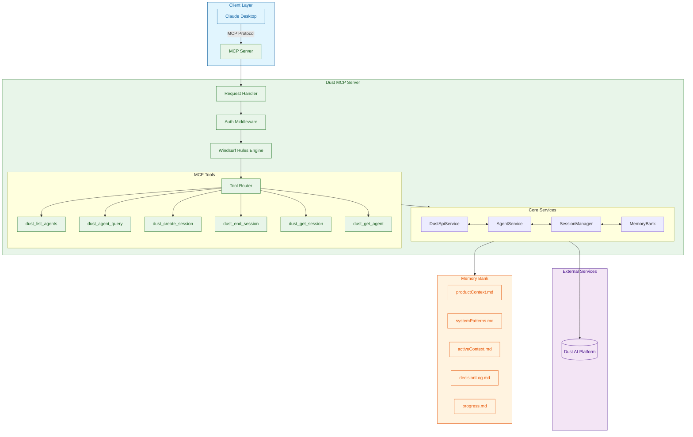

# Dust MCP Server

A Model Context Protocol (MCP) server for Dust.tt agents, designed for seamless integration with Claude Desktop via STDIO. Provides robust agent querying, listing, and configuration tools.

## Table of Contents
- [User Guide](#user-guide)
  - [Overview](#overview)
  - [User Journey](#user-journey)
  - [Quick Start](#quick-start)
  - [Setup and Configuration](#setup-and-configuration)
  - [MCP Tools Reference](#mcp-tools-reference)
  - [Memory Bank System](#memory-bank-system)
- [Developer Guide](#developer-guide)
  - [Project Structure](#project-structure)
  - [Development Setup](#development-setup)
  - [Testing](#testing)
  - [Logging and Debugging](#logging-and-debugging)
  - [API Documentation](#api-documentation)
  - [Deployment](#deployment)
  - [Contributing](#contributing)
  - [License](#license)
  - [Related Resources](#related-resources)

# User Guide

## Overview

The Dust MCP Server provides a standardized interface for interacting with Dust.tt agents through the Model Context Protocol (MCP). It enables seamless integration with Claude Desktop and other MCP-compatible clients, offering features like agent discovery, session management, and message handling.

## User Journey

This section outlines the typical user journey when interacting with the Dust MCP Server and its integrated agents.

### 1. Initial Setup and Agent Discovery

- **Entry Point**: User logs into the Dust platform
- **Agent Discovery**:
  - Views available agents in the Agent Marketplace
  - Filters agents by category (e.g., Data Analysis, Content Creation, Research)
  - Reviews agent capabilities, ratings, and documentation
- **Agent Selection**:
  - Selects multiple agents based on task requirements
  - Creates a new workspace or selects existing one

### 2. Workspace Configuration

- **Layout Setup**:
  - Arranges agent panels in a custom layout
  - Configures agent-specific settings and permissions
- **Context Sharing**:
  - Enables/disables context sharing between agents
  - Sets up data flow between agents
- **File Management**:
  - Uploads files to shared workspace
  - Organizes files in project folders
  - Sets file access permissions per agent

### 3. Multi-Agent Collaboration

- **Conversation Flow**:
  - Initiates chat with primary agent
  - @mentions other agents to bring them into conversation
  - Views inter-agent communication in dedicated threads
- **Task Delegation**:
  - Assigns specific tasks to specialized agents
  - Monitors task progress across agents
  - Views task dependencies and status
- **File Collaboration**:
  - Shares files with specific agents
  - Tracks file access and modifications
  - Views version history and agent contributions

### 4. Advanced Interactions

- **Agent Chaining**:
  - Creates workflows by chaining agents
  - Sets up conditional logic for agent handoffs
  - Configures automatic triggers between agents
- **Context Management**:
  - Reviews and edits shared context
  - Resolves context conflicts between agents
  - Saves context snapshots for future reference

### 5. Reporting and Analysis

- **Report Generation**:
  - Requests reports from analysis agents
  - Customizes report templates and parameters
  - Exports reports in multiple formats (PDF, Markdown, HTML)
- **Insight Visualization**:
  - Views interactive dashboards
  - Filters and drills down into data visualizations
  - Compares outputs from different agents

## Quick Start

### Prerequisites

- Node.js v18 or later
- npm 9.x or later
- A Dust.tt account with API access
- Redis server (for session management)

## Session Management

The Dust MCP Server includes a robust session management system using Redis for persistence. This allows for secure and scalable session handling across multiple instances of the server.

### Features

- **Redis-based Session Storage**: Secure and scalable session storage
- **Session Expiration**: Automatic cleanup of expired sessions
- **Distributed Support**: Works in distributed environments
- **Session Data**: Store arbitrary data with each session
- **API Endpoints**: RESTful API for session management

### Configuration

Add these environment variables to your `.env` file:

```
# Redis Configuration
REDIS_URL=redis://localhost:6379
REDIS_PASSWORD=your_redis_password
REDIS_TLS=false
SESSION_SECRET=your_session_secret_here
SESSION_TTL=86400  # 24 hours in seconds
```

### API Endpoints

#### Create a Session

```http
POST /api/sessions
Content-Type: application/json

{
  "userId": "user123",
  "data": {
    "role": "admin"
  },
  "ttl": 86400
}
```

#### Get Session

```http
GET /api/sessions/:sessionId
Authorization: Bearer <session_token>
```

#### Update Session

```http
PATCH /api/sessions/:sessionId
Authorization: Bearer <session_token>
Content-Type: application/json

{
  "data": {
    "role": "admin",
    "preferences": {}
  },
  "ttl": 86400
}
```

#### Delete Session

```http
DELETE /api/sessions/:sessionId
Authorization: Bearer <session_token>
```

#### Validate Session

```http
GET /api/sessions/:sessionId/validate
Authorization: Bearer <session_token>
```

### Using Session Middleware

To protect routes with session authentication, use the `sessionMiddleware`:

```typescript
import { sessionMiddleware } from './session/routes/sessionRoutes';
import { redisClient } from './config/redis';

// Apply to specific routes
app.get('/protected-route', sessionMiddleware(redisClient), (req, res) => {
  // Access session data
  const session = req.session;
  res.json({ message: 'Access granted', user: session.userId });
});

// Or apply to all routes
app.use(sessionMiddleware(redisClient));
```

### Session Data Structure

```typescript
{
  "sessionId": "unique-session-id",
  "userId": "user123",
  "data": {
    // Custom session data
  },
  "expiresAt": "2025-05-25T12:00:00.000Z",
  "createdAt": "2025-05-24T12:00:00.000Z",
  "updatedAt": "2025-05-24T12:05:00.000Z"
}
```

### Best Practices

1. **Secure Your Session Secret**: Use a strong, unique secret for session encryption
2. **Set Appropriate TTL**: Balance security and user convenience when setting session TTL
3. **Validate Sessions**: Always validate sessions before processing sensitive operations
4. **Handle Session Errors**: Implement proper error handling for session-related operations
5. **Monitor Redis**: Monitor Redis server health and performance metrics

### Troubleshooting

- **Connection Issues**: Verify Redis server is running and accessible
- **Session Expiry**: Check if sessions are expiring too quickly by adjusting TTL
- **Memory Usage**: Monitor Redis memory usage for large session data
- **Logs**: Check server logs for session-related errors

### Installation

1. Clone the repository:

   ```bash
   git clone https://github.com/Ma3u/dust-mcp-server.git
   cd dust-mcp-server
   ```

2. Install dependencies:

   ```bash
   npm install
   ```

3. Create a `.env` file in the root directory with your configuration:

   ```env
   # Required
   DUST_API_KEY=your_dust_api_key
   DUST_WORKSPACE_ID=your_workspace_id
   
   # Optional
   PORT=3000
   NODE_ENV=development
   LOG_LEVEL=info
   
   # Advanced Configuration
   DUST_AGENT_IDS=agent1,agent2,agent3
   MAX_SESSIONS=100
   SESSION_TIMEOUT=3600
   ```

4. Build the project:

   ```bash
   npm run build
   ```

5. Start the server:

   ```bash
   # For development
   npm run dev
   
   # For production
   npm start
   ```

## Setup and Configuration

### Environment Variables

| Variable | Required | Description | Default |
|----------|----------|-------------|---------|
| `DUST_API_KEY` | Yes | Your Dust.tt API key | - |
| `DUST_WORKSPACE_ID` | Yes | Your Dust.tt workspace ID | - |
| `PORT` | No | Port to run the server on | `3000` |
| `NODE_ENV` | No | Node environment (`development`/`production`) | `development` |
| `LOG_LEVEL` | No | Logging level (`error`, `warn`, `info`, `debug`) | `info` |
| `DUST_AGENT_IDS` | No | Comma-separated list of agent IDs to load | - |
| `MAX_SESSIONS` | No | Maximum number of concurrent sessions | `100` |
| `SESSION_TIMEOUT` | No | Session timeout in seconds | `3600` (1 hour) |

### Claude Desktop Integration

To use with Claude Desktop:

1. Install MCP Tools globally:
   ```bash
   npm install -g @modelcontextprotocol/tools
   ```

2. Configure Claude Desktop to use your MCP server:
   ```bash
   mcp configs set claude-desktop dust $(which node) $(pwd)/build/dust.js
   ```

3. Restart Claude Desktop and start interacting with your Dust agents.

## MCP Tools Reference

The following MCP tools are available for interacting with Dust agents:

### `dust_list_agents`

List all available Dust agents in the configured workspace.

**Parameters:**

- `includeDetails` (boolean, optional): Whether to include detailed agent information

**Example:**

```json
{
  "includeDetails": true
}
```

### `dust_agent_query`

Send a query to a Dust agent.

**Parameters:**

- `agentId` (string, required): The ID of the agent to query
- `query` (string, required): The query to send to the agent
- `sessionId` (string, optional): Session ID for continuing a conversation
- `context` (object, optional): Additional context for the query

**Example:**

```json
{
  "agentId": "agent123",
  "query": "What is the weather today?",
  "sessionId": "session_456"
}
```

## Memory Bank System

The Memory Bank system provides persistent storage for agent state and configuration:

- **Active Context**: Tracks the current state of all active agent sessions
- **Decision Log**: Records all agent decisions and actions
- **Progress Tracking**: Monitors task progress and completion status
- **System Patterns**: Defines reusable interaction patterns
- **Product Context**: Stores product-specific configurations and data

---

# Developer Guide

## Project Structure

```text
dust-mcp-server/
├── src/
│   ├── __tests__/           # Test files
│   │   ├── e2e/             # End-to-end tests
│   │   ├── integration/     # Integration tests
│   │   └── unit/            # Unit tests
│   ├── agents/              # Agent implementations
│   ├── api/                 # API routes and controllers
│   ├── middleware/          # Express middleware
│   ├── services/            # Business logic services
│   ├── tools/               # MCP tool implementations
│   ├── types/               # TypeScript type definitions
│   └── utils/               # Utility functions
├── memory-bank/             # Persistent storage for agent state
│   ├── activeContext.md     # Current state of active sessions
│   ├── decisionLog.md       # Log of agent decisions
│   ├── progress.md          # Task progress tracking
│   ├── systemPatterns.md    # Reusable interaction patterns
│   └── productContext.md    # Product-specific configurations
├── docs/                    # Documentation files
├── tests/                   # Additional test resources
├── .env.example             # Example environment variables
├── .eslintrc.json           # ESLint configuration
├── .gitignore               # Git ignore rules
├── jest.config.ts           # Jest test configuration
├── package.json             # Project dependencies and scripts
├── README.md                # This file
└── tsconfig.json            # TypeScript configuration
```

## Development Setup

1. Clone the repository and install dependencies:

   ```bash
   git clone https://github.com/Ma3u/dust-mcp-server.git
   cd dust-mcp-server
   npm install
   ```

2. Set up your development environment:

   ```bash
   # Install development dependencies
   npm install -D typescript ts-node ts-jest @types/jest @types/node
   
   # Set up pre-commit hooks
   npm run prepare
   ```

3. Configure your environment:

   ```bash
   cp .env.example .env
   # Edit .env with your configuration
   ```

4. Start the development server:

   ```bash
   npm run dev
   ```

## Testing

The project includes a comprehensive test suite:

### Running Tests

```bash
# Run all tests
npm test

# Run unit tests
npm run test:unit

# Run integration tests
npm run test:integration

# Run end-to-end tests
npm run test:e2e

# Run tests with coverage
npm run test:coverage
```

### Test Structure

- **Unit Tests**: Test individual functions and classes in isolation
- **Integration Tests**: Test interactions between components
- **E2E Tests**: Test complete user flows

### Test Features

- Mock implementations for external services
- Test database with sample data
- API request/response validation
- Snapshot testing for UI components

## Logging and Debugging

The application uses Winston for logging with the following log levels:

- `error`: Errors that cause the application to fail
- `warn`: Potentially harmful situations
- `info`: General application flow information
- `debug`: Detailed debugging information
- `silly`: Very detailed debugging information

### Debugging in VS Code

Add this configuration to your `.vscode/launch.json`:

```json
{
  "version": "0.2.0",
  "configurations": [
    {
      "type": "node",
      "request": "launch",
      "name": "Debug Tests",
      "runtimeExecutable": "npm",
      "runtimeArgs": ["run", "test:debug"],
      "port": 9229,
      "skipFiles": ["<node_internals>/**"]
    }
  ]
}
```

### Common Issues

1. **TypeScript Errors**: Run `npm run lint:fix` to automatically fix common issues
2. **Test Failures**: Clear the test database with `npm run test:reset`
3. **Dependency Issues**: Delete `node_modules` and run `npm install`

## API Documentation

API documentation is available in the `docs` directory and can be generated using:

```bash
npm run docs:generate
```

The API is documented using OpenAPI (Swagger) and can be viewed at `/api-docs` when running in development mode.

## Deployment

### Prerequisites

- Node.js 18+
- npm 9+
- Docker (optional)

### Production Build

```bash
# Install production dependencies
npm ci --only=production

# Build the application
npm run build

# Start the server
NODE_ENV=production npm start
```

### Docker

```bash
# Build the Docker image
docker build -t dust-mcp-server .

# Run the container
docker run -p 3000:3000 --env-file .env dust-mcp-server
```

## Contributing

1. Fork the repository
2. Create a feature branch (`git checkout -b feature/amazing-feature`)
3. Commit your changes (`git commit -m 'Add some amazing feature'`)
4. Push to the branch (`git push origin feature/amazing-feature`)
5. Open a Pull Request

## License

This project is licensed under the MIT License - see the [LICENSE](LICENSE) file for details.

## Related Resources

- [Dust.tt Documentation](https://docs.dust.tt)
- [Model Context Protocol](https://github.com/modelcontextprotocol/spec)
- [Claude Desktop](https://claude.ai/desktop)
- [Node.js Documentation](https://nodejs.org/en/docs/)
- [TypeScript Documentation](https://www.typescriptlang.org/docs/)
- [Express.js Documentation](https://expressjs.com/)
- [Jest Testing Framework](https://jestjs.io/)
- [Winston Logging](https://github.com/winstonjs/winston)

### Running the Server

You can run the MCP server in two different modes: HTTP mode or STDIO mode.

#### HTTP Mode

To run the server in HTTP mode (for web-based clients):

```bash
npm run build
npm start -- --http
```

The server will listen on the port specified by the `PORT` environment variable (default: 3000).

You can interact with the API at `http://localhost:3000/api`.

#### SSE Events

The server supports real-time event streaming via Server-Sent Events (SSE).

- Connect to `http://localhost:3000/events` with an SSE-compatible client to receive server events (e.g., health, agent updates).
- Example using `curl`:
  ```bash
  curl -N http://localhost:3000/events
  ```

#### STDIO Mode

STDIO mode is used when you want the server to communicate through standard input/output streams rather than HTTP. This is the mode used by Claude Desktop and other MCP clients that communicate via STDIO.

To start the server in STDIO mode:

```bash
# Start the server in STDIO mode
node build/dust.js
```

When running in STDIO mode:
- The server doesn't produce any output to stdout by design, as this channel is reserved for MCP protocol communication
- Any logs or error messages are directed to the logs directory and stderr
- The server is immediately ready to accept MCP client connections

#### Stopping the Server

To stop the server, you can use Ctrl+C in the terminal where it's running, or kill the process:

```bash
pkill -f "node.*dust-mcp-server"
```

## Architecture Diagram



### Key Components

1. **Client Layer**:
   - Claude Desktop communicates with the MCP Server using the MCP protocol

2. **MCP Server**:
   - **Request Handler**: Processes incoming MCP requests
   - **Auth Middleware**: Validates API keys and permissions
   - **Windsurf Rules Engine**: Enforces project-specific rules and workflows
   - **Tool Router**: Routes requests to the appropriate MCP tool
   - **MCP Tools**: Individual tools for agent interaction and session management

3. **Core Services**:
   - **DustApiService**: Handles communication with the Dust AI platform
   - **AgentService**: Manages agent lifecycle and interactions
   - **SessionManager**: Maintains session state and context
   - **MemoryBank**: Manages persistent storage using the memory-bank system

4. **Memory Bank**:
   - `productContext.md`: Project goals and high-level architecture
   - `systemPatterns.md`: Design patterns and implementation details
   - `activeContext.md`: Current status and recent changes
   - `decisionLog.md`: Architectural and implementation decisions
   - `progress.md`: Task tracking and milestones

5. **External Services**:
   - Dust AI Platform: External service for agent execution and processing


### Using MCP Tools

This project uses [MCP Tools](https://github.com/f/mcptools) for testing and integration. Here's how to use them:

1. Install MCP Tools globally

```bash
npm install -g mcptools
```

2. List available tools in the server

```bash
mcp tools node build/dust.js
```

3. Call a specific tool

```bash
mcp call dust_list_agents node build/dust.js --params '{"limit": 10}'

mcp call dust_agent_query node build/dust.js --params '{"query": "Give me a summary"}'
```

4. Add the server to your aliases

```bash
mcp alias add dust node build/dust.js
mcp alias list
```

5. Configure with Claude Desktop

```bash
mcp configs set claude-desktop dust /path/to/node /path/to/dust-mcp-server/build/dust.js
```

## MCP Tools Reference

The server provides the following MCP tools for interacting with Dust.tt agents:

### `dust_list_agents`

List all available agents in the workspace.

**Parameters:**

- `query` (string, optional): Filter agents by name or description
- `view` (string, optional): View type for filtering agents
- `limit` (number, optional): Maximum number of agents to return (default: 10)

**Example Request:**

```bash
mcp call dust_list_agents node build/dust.js --params '{"limit": 10}'
```

**Response:**

```typescript
interface AgentDescriptor {
  id: string;
  name: string;
  description: string;
  capabilities: string[];
  isActive?: boolean;
  lastUsed?: string;
}
```

#### `dust_agent_query`

Query a Dust agent within a session.

**Parameters:**

- `agentId` (string, required): ID of the agent to query
- `message` (string, required): The message to send to the agent
- `files` (Array<{ name: string; content: string }>, optional): Files to include with the message
- `sessionId` (string, optional): Existing session ID to continue conversation

**Example Request:**

```json
{
  "agentId": "agent_123",
  "message": "What's the weather like?",
  "files": [
    {
      "name": "location.txt",
      "content": "San Francisco"
    }
  ]
}
```

**Response:**

```typescript
interface DustMessageResponse {
  response: string;
  context: Record<string, any>;
}
```

#### `dust_create_session`

Create a new session with a Dust agent.

**Parameters:**

- `agentId` (string, required): ID of the agent to create a session with
- `context` (object, optional): Initial context for the session

**Example Request:**

```bash
mcp call dust_create_session node build/dust.js --params '{
  "agentId": "agent_123",
  "context": {
    "userPreferences": {
      "language": "en-US"
    }
  }
}'
```

**Response:**

```typescript
interface SessionDescriptor {
  id: string;
  agentId: string;
  context: Record<string, any>;
  isActive: boolean;
  createdAt: string;
  lastActivity: string;
}
```

#### `dust_end_session`

End an active session.

**Parameters:**

- `sessionId` (string, required): ID of the session to end

**Example Request:**

```bash
mcp call dust_end_session node build/dust.js --params '{"sessionId": "sess_123"}'
```

#### `dust_get_session`

Get details of a specific session.

**Parameters:**

- `sessionId` (string, required): ID of the session to retrieve

**Example Request:**

```bash
mcp call dust_get_session node build/dust.js --params '{"sessionId": "sess_123"}'
```

#### `dust_get_agent`

Get details of a specific agent.

**Parameters:**

- `agentId` (string, required): ID of the agent to retrieve

**Example Request:**

```bash
mcp call dust_get_agent node build/dust.js --params '{"agentId": "agent_123"}'
```

**Response:**

```typescript
interface AgentDescriptor {
  id: string;
  name: string;
  description: string;
  capabilities: string[];
  isActive: boolean;
  createdAt: string;
  updatedAt: string;
  configuration: Record<string, any>;
}
```

## Project Structure

```text
root/
├── src/                # Main source code
│   ├── services/       # Dust API integration layer
│   └── tools/          # (Deprecated) MCP tool implementations
├── build/              # Compiled JavaScript output
├── logs/               # Application and debug logs
│   └── debug/
├── memory-bank/        # Project context and memory files
├── docs/               # Documentation, images, and moved test/demo scripts
├── .env                # Environment configuration (not committed)
├── .env.example        # Example environment file
├── package.json        # Project manifest
└── README.md           # Main documentation (this file)
```

## Testing

### Test Features

The test suite includes the following features:

- **Mocking**: Tests use Jest mocking to isolate the MCP methods from actual API calls
- **Test Data**: Sample agent configurations and responses are provided in `test/fixtures/`
- **Parameter Validation**: Tests verify that parameters are correctly validated
- **Complete Coverage**: Tests cover all parameters and response formats

### Running Tests

You can run the tests using npm scripts:

```bash
# Install dependencies first (if not already installed)
npm install

# Run all tests
npm test

# Run only unit tests
npm run test:unit

# Run only integration tests
npm run test:integration
```

### Manual Testing

You can also manually test the MCP functionality using the scripts in `docs/`:

```bash
# Test MCP tools functionality
node docs/test-mcp-tools.js

# Test STDIO transport
node docs/test-stdio.js
```

## Debugging

### VS Code Debugging

The project includes VS Code debugging configurations for both the server and tests. You can use these configurations to debug the application directly from VS Code.

### Available Debug Configurations

1. **Debug Server (HTTP)**
   - Launches the server in debug mode with auto-reload
   - Attaches to the running Node.js process
   - Supports breakpoints and step debugging

2. **Debug Tests**
   - Runs the test suite in debug mode
   - Supports breakpoints in test files
   - Shows detailed test output

3. **Debug Current Test File**
   - Runs the currently open test file with the debugger attached
   - Useful for focusing on a specific test case
   - Supports breakpoints in test files and source code

4. **Debug All Tests**
   - Runs all tests in the project with the debugger attached
   - Useful for debugging test suites or integration tests
   - Supports breakpoints in test files and source code

#### How to Use

1. Open the project in VS Code
2. Set breakpoints in your code by clicking in the gutter next to the line numbers
3. Open the Run and Debug view (Ctrl+Shift+D or Cmd+Shift+D)
4. Select a debug configuration from the dropdown
5. Click the green play button or press F5 to start debugging

### Log Files

Logs are stored in the `logs/` directory:
- `app-YYYY-MM-DD.log`: Application logs
- `server-YYYY-MM-DD.log`: Server logs
- `test-mcp-YYYY-MM-DD.log`: MCP tools test logs

## Development

```bash
# Run in development mode with auto-reload
npm run dev

# Build the project
npm run build
```

## API Documentation

For more information about the Dust API, see the official documentation:

- [Dust API Documentation](https://docs.dust.tt/reference/openapi)
- [Agent Configurations](https://docs.dust.tt/reference/get_api-v1-w-wid-assistant-agent-configurations-sid)
- [Conversations](https://docs.dust.tt/reference/post_api-v1-w-wid-assistant-conversations)
- [Messages](https://docs.dust.tt/reference/post_api-v1-w-wid-assistant-conversations-cid-messages)

## License

MIT