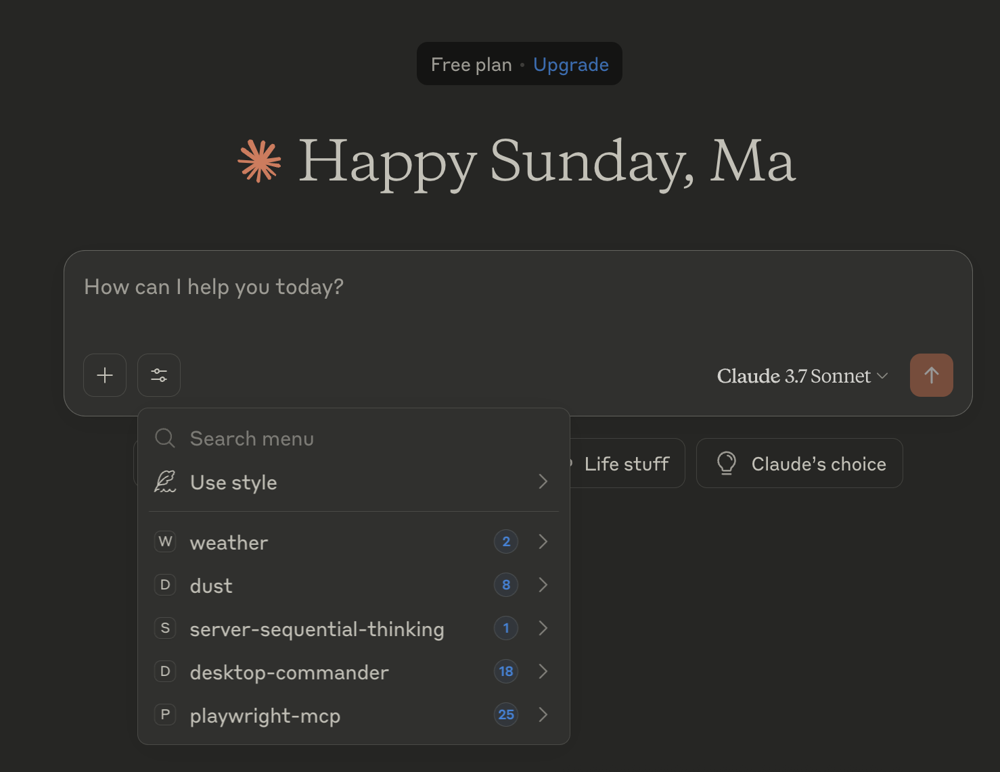
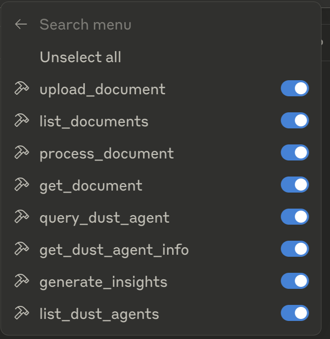
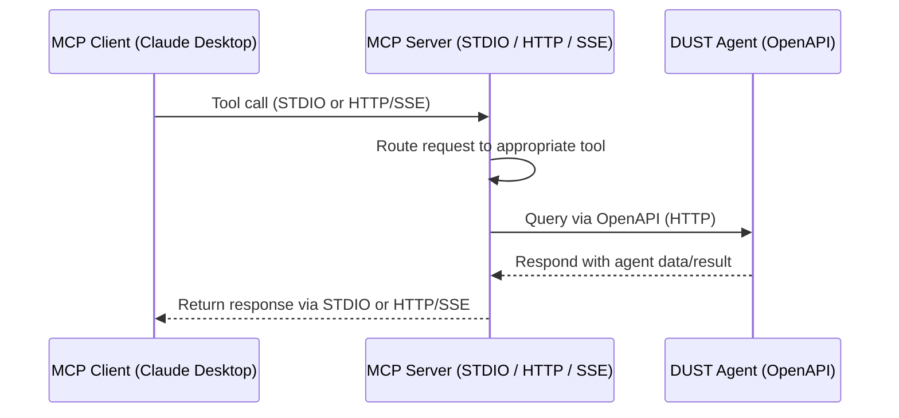

# Dust MCP Server

A Model Context Protocol (MCP) server for Dust.tt agents, designed for seamless integration with Claude Desktop via STDIO. Provides robust agent querying, listing, and configuration tools.

## Table of Contents
- [Dust MCP Server](#dust-mcp-server)
  - [Table of Contents](#table-of-contents)
- [User Guide](#user-guide)
  - [Overview](#overview)
  - [Setup and Configuration](#setup-and-configuration)
    - [Prerequisites](#prerequisites)
    - [Installation](#installation)
    - [Environment Configuration](#environment-configuration)
    - [Claude Desktop Configuration](#claude-desktop-configuration)
    - [Running the Server](#running-the-server)
      - [HTTP Mode](#http-mode)
      - [STDIO Mode](#stdio-mode)
      - [SSE Events](#sse-events)
      - [Smithery Build & Deploy](#smithery-build--deploy)
      - [Managing the Server](#managing-the-server)
    - [Architecture Diagram](#architecture-diagram)
    - [Using MCP Tools](#using-mcp-tools)
  - [Available MCP Tools](#available-mcp-tools)
    - [`dust_list_agents`](#dust_list_agents)
    - [`dust_agent_query`](#dust_agent_query)
    - [`dust_get_agent_config`](#dust_get_agent_config)
  - [Memory Bank System](#memory-bank-system)
  - [Project Structure](#project-structure)
  - [Testing](#testing)
    - [Test Structure](#test-structure)
    - [Running Tests](#running-tests)
    - [Test Features](#test-features)
    - [Manual Testing](#manual-testing)
  - [Debugging](#debugging)
  - [Development](#development)
  - [API Documentation](#api-documentation)
  - [License](#license)

---

# User Guide

---

## Overview

A Model Context Protocol (MCP) server for interacting with Dust.tt agents, designed to work with Claude Desktop via STDIO transport. This server provides tools for querying Dust agents, listing available agents, and retrieving agent configurations.

## Setup and Configuration

### Prerequisites

- Node.js v18+
- npm

### Installation

```bash
# Clone the repository
git clone https://github.com/Ma3u/dust-mcp-server.git
cd dust-mcp-server

# Install dependencies
npm install

# Build the project
npm run build
```

### Environment Configuration

Create a `.env` file in the root directory with the following variables:

```env
DUST_API_KEY=your_dust_api_key
DUST_WORKSPACE_ID=your_workspace_id
DUST_AGENT_IDs=comma,separated,agent,ids
DUST_USERNAME=your_username
DUST_EMAIL=your_email
DUST_FULLNAME=Your Full Name
DUST_API_URL=https://dust.tt/api/v1
```

### Claude Desktop Configuration

This MCP server is designed to work with Claude Desktop via STDIO transport. Follow these steps to configure Claude Desktop to use your Dust MCP server:

1. Make sure you have built the project with `npm run build`

2. Install MCP Tools globally if you haven't already:

   ```bash
   npm install -g mcptools
   ```

3. Configure Claude Desktop to use your Dust MCP server:

   ```bash
   # Replace with your actual paths
   mcp configs set claude-desktop dust /path/to/node /path/to/dust-mcp-server/build/dust.js

   # Example with typical paths
   mcp configs set claude-desktop dust /Users/username/.nvm/versions/node/v18.16.0/bin/node /Users/username/projects/dust-mcp-server/build/dust.js
   ```

4. Verify the configuration was saved:

   ```bash
   mcp configs list
   ```

   The configuration will be saved to `~/Library/Application Support/Claude/claude_desktop_config.json` on macOS.

5. Restart Claude Desktop for the changes to take effect



6. In Claude Desktop, you can now use the Dust MCP tools by asking Claude to:
   - "List my available Dust agents"
   - "Query my Dust agent with [your question]"
   - "Get configuration for my Dust agent [agent_id]"



### Running the Server

You can run the MCP server in two different modes: HTTP mode or STDIO mode.

#### HTTP Mode

To run the server in HTTP mode (for web-based clients):

```bash
npm run build
npm start -- --http
```

The server will listen on the port specified by the `PORT` environment variable (default: 3000).

You can interact with the API at `http://localhost:3000/api`.

#### SSE Events

The server supports real-time event streaming via Server-Sent Events (SSE).

- Connect to `http://localhost:3000/events` with an SSE-compatible client to receive server events (e.g., health, agent updates).
- Example using `curl`:
  ```bash
  curl -N http://localhost:3000/events
  ```

#### STDIO Mode

STDIO mode is used when you want the server to communicate through standard input/output streams rather than HTTP. This is the mode used by Claude Desktop and other MCP clients that communicate via STDIO.

To start the server in STDIO mode:

```bash
# Start the server in STDIO mode
node build/dust.js
```

When running in STDIO mode:
- The server doesn't produce any output to stdout by design, as this channel is reserved for MCP protocol communication
- Any logs or error messages are directed to the logs directory and stderr
- The server is immediately ready to accept MCP client connections

#### Stopping the Server

To stop the server, you can use Ctrl+C in the terminal where it's running, or kill the process:

```bash
pkill -f "node.*dust-mcp-server"
```

---

### Architecture Diagram




### Using MCP Tools

This project uses [MCP Tools](https://github.com/f/mcptools) for testing and integration. Here's how to use them:

1. Install MCP Tools globally

```bash
npm install -g mcptools
```

2. List available tools in the server

```bash
mcp tools node build/dust.js
```

3. Call a specific tool

```bash
mcp call dust_list_agents node build/dust.js --params '{"limit": 10}'

mcp call dust_agent_query node build/dust.js --params '{"query": "Give me a summary"}'
```

4. Add the server to your aliases

```bash
mcp alias add dust node build/dust.js
mcp alias list
```

5. Configure with Claude Desktop

```bash
mcp configs set claude-desktop dust /path/to/node /path/to/dust-mcp-server/build/dust.js
```

## Available MCP Tools

The server provides the following MCP tools for interacting with Dust.tt agents:

### `dust_list_agents`

Lists available Dust agents in your workspace.

**Parameters:**

- `view` (optional): View type for filtering agents
- `limit` (optional): Maximum number of agents to return

**Returns:**

- Markdown formatted list of available Dust agents with their capabilities
- JSON data of all agent configurations

**Example:**

```bash
mcp call dust_list_agents node build/dust.js --params '{"limit": 10}'
```

### `dust_agent_query`

Queries a Dust agent with a natural language prompt.

**Parameters:**

- `agent_id` (optional): ID of the agent to query (will use default if not provided)
- `query` (required): Message to send to the agent
- `conversation_id` (optional): ID of an existing conversation to continue
- `context` (optional): Additional context for the agent

**Returns:**

- Agent's response to the query
- Conversation and message IDs for future reference

**Example:**

```bash
mcp call dust_agent_query node build/dust.js --params '{"query": "Give me a summary of the Dust API"}'
```

### `dust_get_agent_config`

Get detailed configuration for a specific Dust agent.

**Parameters:**

- `agent_id` (required): ID of the agent to get configuration for

**Returns:**

- Markdown formatted agent configuration details
- JSON data of the complete agent configuration

**Example:**

```bash
mcp call dust_get_agent_config node build/dust.js --params '{"agent_id": "agent-id-123"}'
```

## Memory Bank System

This project uses a memory-bank system for maintaining project context and persistent storage instead of built-in memories. The memory-bank system consists of several markdown files that track different aspects of the project:

- `/memory-bank/productContext.md`: High-level overview of the project and product
- `/memory-bank/activeContext.md`: Current status, recent changes, and open questions
- `/memory-bank/progress.md`: Task tracking in a list format
- `/memory-bank/decisionLog.md`: Record of architectural and implementation decisions
- `/memory-bank/systemPatterns.md`: Documentation of recurring patterns and standards

The memory-bank system provides a clear separation between the project's persistent storage and any external memory systems.

## Project Structure

```
root/
├── src/                # Main source code
│   ├── services/       # Dust API integration layer
│   └── tools/          # (Deprecated) MCP tool implementations
├── build/              # Compiled JavaScript output
├── logs/               # Application and debug logs
│   └── debug/
├── memory-bank/        # Project context and memory files
├── docs/               # Documentation, images, and moved test/demo scripts
├── .env                # Environment configuration (not committed)
├── .env.example        # Example environment file
├── package.json        # Project manifest
├── README.md           # Main documentation (this file)
└── ...
```

## Testing

The project includes a comprehensive test suite for all MCP methods using Jest. The tests are organized into unit tests and integration tests.

### Test Structure

- **Unit Tests**: Individual tests for each MCP method
  - `dust_agent_query.test.js` - Tests for querying Dust agents
  - `dust_list_agents.test.js` - Tests for listing available agents
  - `dust_get_agent_config.test.js` - Tests for retrieving agent configurations

- **Integration Tests**: Tests that verify the complete flow
  - `dust_mcp_integration.test.js` - Tests the end-to-end flow of listing agents, getting configuration, and querying an agent

### Running Tests

You can run the tests using npm scripts:

```bash
# Install dependencies first (if not already installed)
npm install

# Run all tests
npm test

# Run only unit tests
npm run test:unit

# Run only integration tests
npm run test:integration
```

### Test Features

- **Mocking**: Tests use Jest mocking to isolate the MCP methods from actual API calls
- **STDIO Transport**: Tests use the STDIO transport to communicate with the MCP server
- **Error Handling**: Tests verify proper error handling for various scenarios
- **Parameter Validation**: Tests verify that parameters are correctly validated
- **Complete Coverage**: Tests cover all parameters and response formats

### Manual Testing

You can also manually test the MCP functionality using the scripts in `docs/`:

```bash
# Test MCP tools functionality
node docs/test-mcp-tools.js

# Test STDIO transport
node docs/test-stdio.js
```

## Debugging

Logs are stored in the `logs/` directory:
- `app-YYYY-MM-DD.log`: Application logs
- `server-YYYY-MM-DD.log`: Server logs
- `test-mcp-YYYY-MM-DD.log`: MCP tools test logs

## Development

```bash
# Run in development mode with auto-reload
npm run dev

# Build the project
npm run build
```

## API Documentation

For more information about the Dust API, see the official documentation:

- [Dust API Documentation](https://docs.dust.tt/reference/openapi)
- [Agent Configurations](https://docs.dust.tt/reference/get_api-v1-w-wid-assistant-agent-configurations-sid)
- [Conversations](https://docs.dust.tt/reference/post_api-v1-w-wid-assistant-conversations)
- [Messages](https://docs.dust.tt/reference/post_api-v1-w-wid-assistant-conversations-cid-messages)

## License

MIT