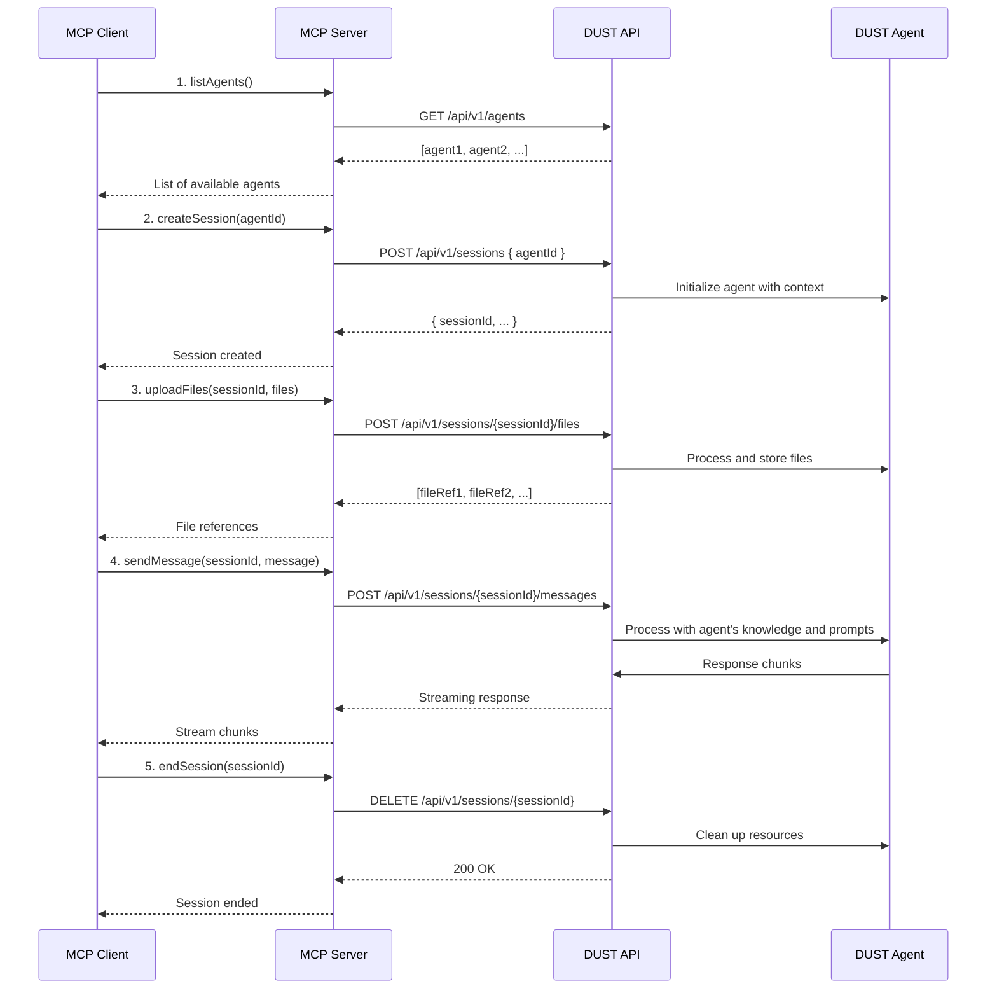

# Product Context

This file provides a high-level overview of the project and the expected product that will be created. Initially it is based upon projectBrief.md (if provided) and all other available project-related information in the working directory. This file is intended to be updated as the project evolves, and should be used to inform all other modes of the project's goals and context.

"2025-05-19 09:04:18" - Added detailed user journey for multi-agent interaction.

## Project Goal

The Dust MCP Server project is a server implementation for integrating with Dust AI services using the Model Context Protocol (MCP). It serves as a middleware connector between client applications (particularly Claude Desktop) and Dust AI agents, enabling health data processing, analysis, and insights generation through AI agents.

## Key Features

- Integration with Dust AI services using the Dust TypeScript SDK
- MCP-compliant server implementation for agent communication
- File upload and document processing capabilities
- Analysis of uploaded files through specialized Dust agents
- Support for both STDIO (Prio 1) and HTTP/SSE (Prio 2) transport modes
- Session state management for preserving context across interactions
- Multi-agent orchestration and context passing

## Overall Architecture

The project follows a TypeScript-based server architecture with modular components:

- **Core Server**: Express.js-based server with MCP SDK integration
- **Transport Layer**: Support for both STDIO (for Claude Desktop) and HTTP/SSE
- **Tool Components**:
  - File Upload: Handles document uploads with metadata tracking
  - Document Processor: Extracts and structures information from documents
  - Dust Agent: Interfaces with Dust AI services for data analysis
- **Directory Structure**:
  - `/src`: Source code with modular components
  - `/uploads`: Storage for uploaded documents
  - `/processed`: Storage for processed document data
  - `/logs`: Application logs

The system is designed to process documents, extract relevant information, and use Dust AI agents to analyze and generate insights from the data.

## User Journey: Multi-Agent Interaction

### 1. Initial Setup and Agent Discovery

- **Entry Point**: User logs into the Dust platform

- **Agent Discovery**:
  - Views available agents in the Agent Marketplace
  - Filters agents by category (e.g., Data Analysis, Content Creation, Research)
  - Reviews agent capabilities, ratings, and documentation

- **Agent Selection**:
  - Selects multiple agents based on task requirements
  - Creates a new workspace or selects existing one

### 2. Workspace Configuration

- **Layout Setup**:
  - Arranges agent panels in a custom layout
  - Configures agent-specific settings and permissions

- **Context Sharing**:
  - Enables/disables context sharing between agents
  - Sets up data flow between agents

- **File Management**:
  - Uploads files to shared workspace
  - Organizes files in project folders
  - Sets file access permissions per agent

### 3. Multi-Agent Collaboration

- **Conversation Flow**:
  - Initiates chat with primary agent
  - @mentions other agents to bring them into conversation
  - Views inter-agent communication in dedicated threads

- **Task Delegation**:
  - Assigns specific tasks to specialized agents
  - Monitors task progress across agents
  - Views task dependencies and status

- **File Collaboration**:
  - Shares files with specific agents
  - Tracks file access and modifications
  - Views version history and agent contributions

### 4. Advanced Interactions

- **Agent Chaining**:
  - Creates workflows by chaining agents
  - Sets up conditional logic for agent handoffs
  - Configures automatic triggers between agents

- **Context Management**:
  - Reviews and edits shared context
  - Resolves context conflicts between agents
  - Saves context snapshots for future reference

### 5. Reporting and Analysis

- **Report Generation**:
  - Requests reports from analysis agents
  - Customizes report templates and parameters
  - Exports reports in multiple formats (PDF, Markdown, HTML)

- **Insight Visualization**:
  - Views interactive dashboards
  - Filters and drills down into data visualizations
  - Compares outputs from different agents

### 6. Session Management

- **Session Saving**:
  - Saves current workspace state
  - Names and tags sessions for retrieval
  - Shares sessions with team members

- **History and Versioning**:
  - Reviews interaction history
  - Reverts to previous states
  - Compares different versions of agent outputs

### 7. Integration and Export

- **Data Export**:
  - Exports agent conversations
  - Saves processed data in structured formats
  - Generates API documentation for agent interactions

- **Third-party Integration**:
  - Connects to external tools (e.g., Notion, Slack, GitHub)
  - Sets up webhooks for automated workflows
  - Monitors integration status

## Existing Files and Resources

### Core Application Files

- `src/`
  - `agents/`: Agent definitions and configurations
  - `api/`: REST API endpoints
  - `services/`: Core services for agent management
  - `utils/`: Shared utilities and helpers

### Configuration

- `.env`: Environment variables
- `package.json`: Dependencies and scripts
- `tsconfig.json`: TypeScript configuration

### Documentation

- `docs/`
  - `api/`: API documentation
  - `guides/`: User guides and tutorials
  - `examples/`: Example implementations

## Agent Capabilities

### Document Analysis Agent

- Processes and analyzes uploaded documents
- Extracts key information and metadata
- Generates summaries and insights

### Data Processing Agent

- Handles structured and unstructured data
- Performs data cleaning and transformation
- Generates visualizations and reports

### Research Agent

- Conducts web research
- Validates information from multiple sources
- Compiles research findings

### Content Generation Agent

- Creates written content
- Adapts tone and style
- Ensures consistency with brand guidelines

## MCP Integration with DUST Agents

### MCP Server Architecture

The MCP (Model Context Protocol) server acts as a middleware between clients and DUST's agent ecosystem, providing a standardized interface for agent interaction.

### Core MCP Methods

#### 1. Agent Discovery

```typescript
interface AgentDiscovery {
  // List all available agents for the authenticated user
  listAgents(): Promise<AgentDescriptor[]>;
  
  // Get details about a specific agent
  getAgent(agentId: string): Promise<AgentDetails>;
}
```

#### 2. Session Management

```typescript
interface SessionManagement {
  // Create a new session with optional initial context
  createSession(agentId: string, context?: Record<string, any>): Promise<Session>;
  
  // Resume an existing session
  getSession(sessionId: string): Promise<Session>;
  
  // End a session
  endSession(sessionId: string): Promise<void>;
}
```

#### 3. Agent Interaction

```typescript
interface AgentInteraction {
  // Send a message to an agent
  sendMessage(sessionId: string, message: Message): Promise<AgentResponse>;
  
  // Stream response from agent
  streamResponse(sessionId: string, callback: (chunk: string) => void): void;
  
  // Upload files to agent context
  uploadFiles(sessionId: string, files: File[]): Promise<FileReference[]>;
}
```

### Communication Flow



### Authentication & Security

- All MCP endpoints require authentication using API keys or OAuth 2.0 tokens
- Session tokens are used for subsequent requests after initial authentication
- File uploads are validated for size and type restrictions
- All communications are encrypted using TLS 1.3

### Error Handling

Standard HTTP status codes are used with detailed error responses:

- `400 Bad Request`: Invalid input parameters
- `401 Unauthorized`: Missing or invalid authentication
- `403 Forbidden`: Insufficient permissions
- `404 Not Found`: Resource not found
- `429 Too Many Requests`: Rate limit exceeded
- `500 Internal Server Error`: Server-side error

### Performance Considerations

- Session timeouts after 30 minutes of inactivity
- Response streaming with chunked transfer encoding
- Client-side caching of agent metadata
- Rate limiting per API key/account
