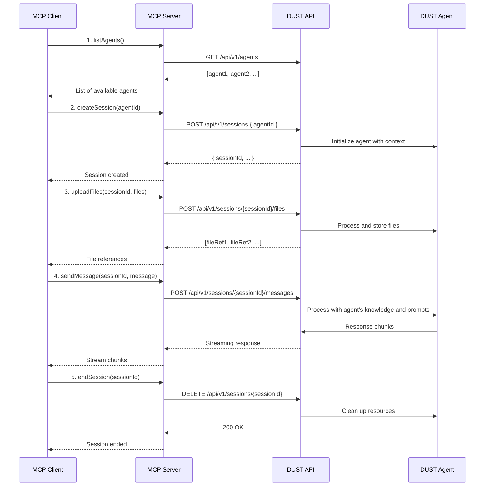

# Product Context

This file provides a high-level overview of the project and the expected product that will be created. Initially it is based upon projectBrief.md (if provided) and all other available project-related information in the working directory. This file is intended to be updated as the project evolves, and should be used to inform all other modes of the project's goals and context.

"2025-05-19 09:04:18" - Added detailed user journey for multi-agent interaction.

## Table of Contents

- [Project Goal](#project-goal)
- [User Personas](#user-personas)
  - [1. Business Analyst](#1-business-analyst)
  - [2. Software Engineer](#2-software-engineer)
- [User Journeys](#user-journeys)
  - [Business Analyst with Claude Desktop](#user-journey-1-business-analyst-with-claude-desktop)
  - [Software Engineer in Windsurf IDE](#user-journey-2-software-engineer-in-windsurf-ide)
- [Key Features](#key-features)
- [Overall Architecture](#overall-architecture)
- [Implementation Roadmap](#implementation-roadmap)
- [Implementation Details](#implementation-details)

## Project Goal

The Dust MCP Server project is a server implementation for integrating with Dust AI services using the Model Context Protocol (MCP). It serves as a middleware connector between client applications (particularly Claude Desktop) and Dust AI agents, enabling data processing, analysis, and insights generation through AI agents. The implementation includes a comprehensive test suite covering unit, integration, and end-to-end testing scenarios.

## User Personas

### 1. Business Analyst

- **Role**: Data and Business Analysis
- **Key Tools**: Dust Agents, Spaces, Claude Desktop
- **Needs**:
  - Simplified local frontend for data analysis
  - Easy integration of various data sources via MCP
  - Visual workflow builder for agent interactions
  - Pre-built templates for common analysis tasks
- **Frustrations**:
  - Complex setup processes
  - Switching between multiple tools
  - Manual data preparation and cleaning

### 2. Software Engineer

- **Role**: System and Requirements Engineering
- **Key Tools**: Dust Agents, Spaces, IDE (Windsurf)
- **Needs**:
  - Seamless integration with development environment
  - Ability to work with cloud-based servers
  - Version control integration
  - Automated testing of agent interactions
- **Frustrations**:
  - Context switching between tools
  - Manual deployment processes
  - Lack of development tooling integration

## User Journeys

### User Journey 1: Business Analyst with Claude Desktop

### Business Analyst Overview

This journey describes how a Business Analyst uses Claude Desktop with Dust Agents and Spaces to perform data analysis through a simplified local interface.

#### 1. Initial Setup

- **Installation**
  - Downloads and installs Claude Desktop with one-click installer
  - MCP Server is automatically configured during installation
  - No command-line or technical setup required

- **Workspace Configuration**
  - Connects to existing Dust Spaces
  - Sets up local data source connections (CSV, Excel, Databases)
  - Configures default analysis templates and dashboards

#### 2. Daily Workflow

- **Data Preparation**
  - Imports data from various sources via drag-and-drop
  - Uses visual tools to clean and transform data
  - Saves data preparation steps as reusable workflows

- **Analysis with Agents**
  - Selects from pre-configured analysis templates
  - Customizes agent parameters through simple forms
  - Views real-time results in interactive dashboards
  - Saves and shares analysis configurations

- **Collaboration**
  - Shares analysis with team members
  - Comments on specific data points
  - Tracks changes and versions of analyses

#### 3. Advanced Features

- **Custom Data Connectors**
  - Creates reusable connectors for internal data sources
  - Schedules automatic data refreshes
  - Manages credentials securely

- **Automation**
  - Schedules recurring analyses
  - Sets up alerts for data thresholds
  - Creates automated reports and exports

### User Journey 2: Software Engineer in Windsurf IDE

### Software Engineer Overview

This journey describes how a Software Engineer uses Dust Agents and Spaces directly within their Windsurf IDE for system and requirements engineering tasks.

#### 1. Development Environment Setup

- **IDE Integration**
  - Installs Dust extension for Windsurf IDE
  - Configures connection to cloud-based MCP servers
  - Sets up local development environment

- **Project Configuration**
  - Imports existing Dust Spaces and agents
  - Configures local and remote execution environments
  - Sets up version control integrations

#### 2. Development Workflow

- **Agent Development**
  - Creates and tests agents directly in the IDE
  - Uses code completion and IntelliSense for agent development
  - Runs and debugs agents locally or in the cloud

- **Version Control**
  - Commits agent configurations and code to Git
  - Creates branches for new features
  - Reviews and merges changes through PRs

- **Testing**
  - Writes and runs unit tests for agents
  - Sets up integration tests for agent workflows
  - Performs load testing for high-volume scenarios

#### 3. Deployment and Operations

- **CI/CD Integration**
  - Configures automated testing pipelines
  - Sets up deployment to staging and production
  - Implements blue/green deployments

- **Monitoring and Debugging**
  - Views real-time logs and metrics
  - Debugs production issues with remote debugging
  - Performs A/B testing of agent versions

- **Scaling**
  - Configures auto-scaling for agents
  - Monitors resource usage and performance
  - Optimizes agent performance and cost

## Key Features

- Integration with Dust AI services using the Dust TypeScript SDK
- MCP-compliant server implementation for agent communication
- File upload and document processing capabilities
- Analysis of uploaded files through specialized Dust agents
- Support for both STDIO (Prio 1) and HTTP/SSE (Prio 2) transport modes
- Session state management for preserving context across interactions
- Multi-agent orchestration and context passing

## Overall Architecture

The project follows a TypeScript-based server architecture with modular components:

- **Core Server**: Express.js-based server with MCP SDK integration
- **Transport Layer**: Support for both STDIO (for Claude Desktop) and HTTP/SSE
- **Testing Framework**: Comprehensive test suite with Jest for unit, integration, and end-to-end tests
- **Tool Components**:
  - File Upload: Handles document uploads with metadata tracking
  - Document Processor: Extracts and structures information from documents
  - Dust Agent: Interfaces with Dust AI services for data analysis
  - Agent Service: Manages agent lifecycle and session state
- **Directory Structure**:
  - `/src`: Source code with modular components
    - `/api`: API routes, controllers, and middleware
    - `/services`: Business logic and service layer
    - `/types`: TypeScript type definitions
    - `/utils`: Utility functions and helpers
    - `/__tests__/unit`: Unit tests
    - `/__tests__/integration`: Integration tests
    - `/__tests__/e2e`: End-to-end tests
  - `/docs`: Documentation including API specs and user guides
  - `/logs`: Application logs (not version controlled)
  - `/.github`: GitHub workflows and templates

The system is designed to process documents, extract relevant information, and use Dust AI agents to analyze and generate insights from the data. The implementation includes a comprehensive test suite that validates all critical paths and edge cases, ensuring reliability and maintainability.

## Implementation Roadmap

### Phase 1: Core STDIO Support (Current)

- [x] Basic STDIO transport implementation
- [x] Local file system integration
- [x] Session management for local operations
- [x] Basic error handling and recovery

### Phase 2: HTTP/SSE Transport

- [ ] Implement HTTP server with SSE support
- [ ] Add authentication middleware
- [ ] Create client SDK for remote connections
- [ ] Implement connection pooling and management

### Phase 3: Advanced Features

- [ ] Load balancing for multiple clients
- [ ] Distributed session management
- [ ] Advanced monitoring and metrics
- [ ] Team collaboration features

## Feature Comparison: STDIO vs HTTP/SSE

| Feature                         | STDIO (Claude Desktop)     | HTTP/SSE (Remote Clients)    |
|--------------------------------|----------------------------|-----------------------------|
| Transport                      | Local subprocess            | Network (HTTP/SSE)          |
| Server Location               | Local machine              | Cloud/on-premises           |
| Use Case                      | Local file access          | Team collaboration          |
| Authentication                | System user context        | API keys, OAuth             |
| Performance                   | Low latency                | Network-dependent           |
| Scalability                   | Single user                | Multi-tenant                |
| Example Clients               | Claude Desktop             | Cursor, VS Code, Simple AI  |
| Deployment Complexity         | Simple                     | Moderate                    |
| Maintenance                   | User-managed               | Centrally managed           |
| Data Privacy                 | Local only                 | Network transfer required   |

## Implementation Details

### 1. Core Architecture

- **Modular Design**
  - Decoupled components for maintainability and scalability
  - Clear separation of concerns between transport, business logic, and agent interfaces
  - Plugin-based architecture for easy extension

- **Transport Layer**
  - Dual support for STDIO (local) and HTTP/SSE (remote) communication
  - Automatic protocol negotiation and fallback mechanisms
  - Connection pooling and session management

### 2. File Management

- **Supported Formats**
  - Documents: PDF, DOCX, PPTX, XLSX
  - Text: TXT, Markdown, JSON, CSV
  - Images: JPG, PNG (with OCR support)
  - Maximum file size: 50MB per file

- **Processing Pipeline**
  - Automatic file type detection and validation
  - Secure temporary storage with automatic cleanup
  - Metadata extraction and indexing
  - Chunking for large files with context preservation

### 3. Agent Interaction and Orchestration

- **Agent Registry**
  - Dynamic discovery of available agents
  - Capability-based routing of requests
  - Versioning and compatibility management

- **Workflow Engine**
  - Visual workflow designer for multi-agent processes
  - Conditional branching and error handling
  - State persistence and recovery
  - Timeout and retry mechanisms

- **Session Management**
  - Isolated conversation contexts
  - Long-running session support
  - Context summarization for large histories
  - Automatic session cleanup

### 4. Security and Access Control

- **Authentication**
  - OAuth 2.0 with Dust platform
  - API key support for service-to-service communication
  - Session token rotation

- **Authorization**
  - Role-based access control (RBAC)
  - Fine-grained permissions for operations
  - Audit logging for all sensitive actions

### 5. Monitoring and Observability

- **Metrics Collection**
  - Performance metrics (latency, throughput)
  - Resource utilization
  - API usage and quotas

- **Logging**
  - Structured logging with request correlation
  - Configurable log levels
  - Log rotation and retention policies

- **Alerting**
  - Custom alert rules
  - Integration with monitoring tools
  - Health check endpoints

### 6. Integration Capabilities

- **Third-Party Integrations**
  - Pre-built connectors for common services
  - Webhook support for event-driven workflows
  - Custom adapter development kit

- **Developer Tools**
  - Interactive API documentation (OpenAPI/Swagger)
  - SDKs for multiple languages
  - Local development server with hot-reload

- **Data Sources**
  - Database connectors (SQL, NoSQL)
  - Cloud storage providers (S3, GCS, Azure Blob)
  - API clients for REST and GraphQL services

## Future Roadmap

- **Collaboration Features**
  - Shares conversations and agent interactions via Dust's collaboration features
  - Invites team members to join active sessions
  - Tracks changes and contributions from different users

- **Analysis and Reporting**:
  - Generates reports using Dust's analysis capabilities
  - Exports conversation history and agent outputs
  - Creates custom dashboards for recurring analysis tasks

- **Enhanced Collaboration**:
  - Real-time co-editing of agent prompts and configurations
  - Team workspaces with shared agent presets
  - Version control for agent interactions

- **Context Management**:
  - Manual context editing
  - Context summarization
  - Context versioning and branching

- **Custom Tools and Integrations**:
  - Create custom tools with TypeScript/JavaScript
  - Integrate with external APIs and services
  - Share tools across workspaces

## Technical Architecture

### Core Components

- **Agents**: Handle specific tasks and workflows
- **API Layer**: Manages communication between components
- **Services**: Core functionality for agent management
- **Storage**: Persistent data storage and caching
  - `utils/`: Shared utilities and helpers

### Configuration

- `.env`: Environment variables
- `package.json`: Dependencies and scripts
- `tsconfig.json`: TypeScript configuration

### Documentation

- `docs/`
  - `api/`: API documentation
  - `guides/`: User guides and tutorials
  - `examples/`: Example implementations


## Details MCP Integration with DUST Agents

### MCP Server Architecture

The MCP (Model Context Protocol) server acts as a middleware between clients and DUST's agent ecosystem, providing a standardized interface for agent interaction.

### Core MCP Methods

#### 1. Agent Discovery

```typescript
interface AgentDiscovery {
  // List all available agents for the authenticated user
  listAgents(): Promise<AgentDescriptor[]>;
  
  // Get details about a specific agent
  getAgent(agentId: string): Promise<AgentDetails>;
}
```

#### 2. Session Management

```typescript
interface SessionManagement {
  // Create a new session with optional initial context
  createSession(agentId: string, context?: Record<string, any>): Promise<Session>;
  
  // Resume an existing session
  getSession(sessionId: string): Promise<Session>;
  
  // End a session
  endSession(sessionId: string): Promise<void>;
}
```

#### 3. Agent Interaction

```typescript
interface AgentInteraction {
  // Send a message to an agent
  sendMessage(sessionId: string, message: Message): Promise<AgentResponse>;
  
  // Stream response from agent
  streamResponse(sessionId: string, callback: (chunk: string) => void): void;
  
  // Upload files to agent context
  uploadFiles(sessionId: string, files: File[]): Promise<FileReference[]>;
}
```

### Communication Flow



### Authentication & Security

- All MCP endpoints require authentication using API keys or OAuth 2.0 tokens
- Session tokens are used for subsequent requests after initial authentication
- File uploads are validated for size and type restrictions
- All communications are encrypted using TLS 1.3

### Error Handling

Standard HTTP status codes are used with detailed error responses:

- `400 Bad Request`: Invalid input parameters
- `401 Unauthorized`: Missing or invalid authentication
- `403 Forbidden`: Insufficient permissions
- `404 Not Found`: Resource not found
- `429 Too Many Requests`: Rate limit exceeded
- `500 Internal Server Error`: Server-side error

### Performance Considerations

- Session timeouts after 30 minutes of inactivity
- Response streaming with chunked transfer encoding
- Client-side caching of agent metadata
- Rate limiting per API key/account
