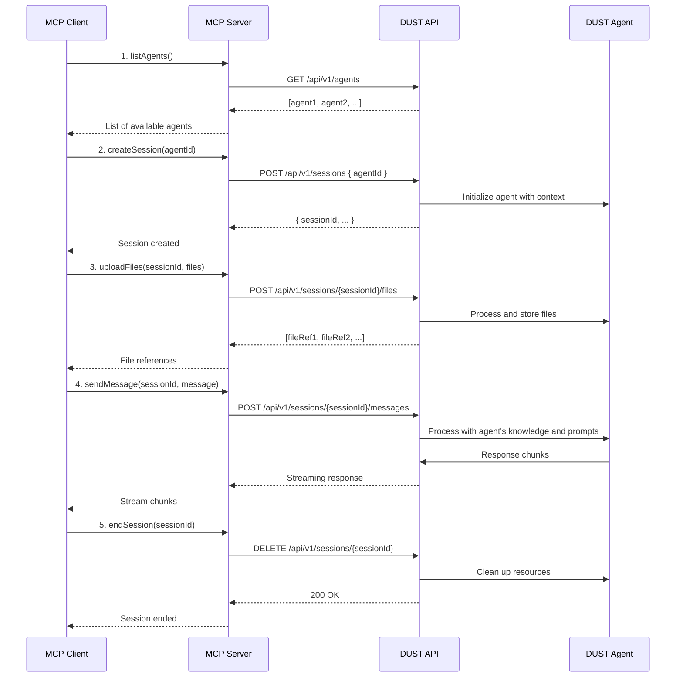

# Product Context

This file provides a high-level overview of the project and the expected product that will be created. Initially it is based upon projectBrief.md (if provided) and all other available project-related information in the working directory. This file is intended to be updated as the project evolves, and should be used to inform all other modes of the project's goals and context.

"2025-05-19 09:04:18" - Added detailed user journey for multi-agent interaction.

## Project Goal

The Dust MCP Server project is a server implementation for integrating with Dust AI services using the Model Context Protocol (MCP). It serves as a middleware connector between client applications (particularly Claude Desktop) and Dust AI agents, enabling data processing, analysis, and insights generation through AI agents. The implementation includes a comprehensive test suite covering unit, integration, and end-to-end testing scenarios.

## Key Features

- Integration with Dust AI services using the Dust TypeScript SDK
- MCP-compliant server implementation for agent communication
- File upload and document processing capabilities
- Analysis of uploaded files through specialized Dust agents
- Support for both STDIO (Prio 1) and HTTP/SSE (Prio 2) transport modes
- Session state management for preserving context across interactions
- Multi-agent orchestration and context passing

## Overall Architecture

The project follows a TypeScript-based server architecture with modular components:

- **Core Server**: Express.js-based server with MCP SDK integration
- **Transport Layer**: Support for both STDIO (for Claude Desktop) and HTTP/SSE
- **Testing Framework**: Comprehensive test suite with Jest for unit, integration, and end-to-end tests
- **Tool Components**:
  - File Upload: Handles document uploads with metadata tracking
  - Document Processor: Extracts and structures information from documents
  - Dust Agent: Interfaces with Dust AI services for data analysis
  - Agent Service: Manages agent lifecycle and session state
- **Directory Structure**:
  - `/src`: Source code with modular components
    - `/api`: API routes, controllers, and middleware
    - `/services`: Business logic and service layer
    - `/types`: TypeScript type definitions
    - `/utils`: Utility functions and helpers
    - `/__tests__/unit`: Unit tests
    - `/__tests__/integration`: Integration tests
    - `/__tests__/e2e`: End-to-end tests
  - `/docs`: Documentation including API specs and user guides
  - `/logs`: Application logs (not version controlled)
  - `/.github`: GitHub workflows and templates

The system is designed to process documents, extract relevant information, and use Dust AI agents to analyze and generate insights from the data. The implementation includes a comprehensive test suite that validates all critical paths and edge cases, ensuring reliability and maintainability.

## User Journey 1: Claude Desktop (STDIO Transport)

### Overview

Claude Desktop's integration with Dust via the MCP server enables powerful AI-assisted workflows through a local STDIO-based interface. This section details how users can interact with Dust agents and workspaces, including creating and continuing conversations, uploading files, and managing AI-assisted tasks.

### Key Capabilities

1. **Agent Interaction**
   - List and select from available Dust agents
   - Chain multiple agents for complex workflows
   - View and manage agent configurations

2. **Workspace Management**
   - Switch between different workspaces
   - Create and organize conversations
   - Manage access and permissions

3. **Conversation Flow**
   - Start new conversations with specific agents
   - Continue existing conversations with full context
   - Reference previous interactions and files

4. **File Operations**
   - Upload and process various file types
   - Reference files in conversations
   - View and manage uploaded files

### 1. Initial Setup and Configuration

- **Prerequisites**:
  - Node.js (v16+) and NPM (v8+) installed locally
  - Claude Desktop application installed
  - Valid Dust API credentials with workspace access
  - Local development environment with required dependencies

- **Configuration**:
  - User opens Claude Desktop settings
  - Navigates to MCP Server configuration
  - Configures `claude_desktop_config.json` with:
    ```json
    {
      "mcpServers": {
        "dust": {
          "command": "node",
          "args": ["/path/to/dust-mcp-server/dist/index.js"],
          "env": {
            "DUST_API_KEY": "your-api-key",
            "WORKSPACE_ID": "target-workspace-id"
          }
        }
      }
    }
    ```
  - Saves configuration and restarts Claude Desktop

- **Authentication Flow**:
  1. User provides Dust API key
  2. System validates credentials and retrieves available workspaces
  3. User selects default workspace
  4. Session token is stored securely in system keychain

- **Workspace Initialization**:
  ```typescript
  // Example: Initialize workspace session
  const initResponse = await fetch('https://dust.tt/api/v1/workspaces/{workspaceId}/init', {
    method: 'POST',
    headers: {
      'Authorization': `Bearer ${apiKey}`,
      'Content-Type': 'application/json'
    },
    body: JSON.stringify({
      client: 'claude-desktop',
      version: '1.0.0'
    })
  });
  ```

- **Configuration Validation**:
  - Verifies API connectivity
  - Validates workspace access
  - Tests file system permissions
  - Initializes local cache

### 2. Session Initialization

- **Local Server Startup**:
  - Claude Desktop starts the MCP server as a subprocess via STDIO
  - Server initializes with user's local environment context
  - Local file system access permissions are established

- **Session Management**:
  - Creates new MCP sessions with full context preservation
  - Manages multiple concurrent sessions for different tasks
  - All operations execute within user's local security context

### 3. Local File Operations

- **File Access**:
  - User requests file operations through natural language
  - Claude Desktop routes requests to local MCP server via STDIO
  - User grants explicit permissions for file system access
  - Operations execute with user's local permissions

- **Data Processing**:
  - Local files are processed by Dust agents
  - Processing occurs entirely on the local machine
  - No data leaves the user's system without explicit consent

### 4. Security and Permissions

- **Local Execution**:
  - All operations run with user's local permissions
  - No network communication required for local operations
  - Clear audit trail of all file system access

- **Permission Model**:
  - Explicit user approval for sensitive operations
  - Granular control over file system access
  - Session-based permission persistence

## User Journey 2: Remote MCP Clients (HTTP/SSE Transport)

### Overview

Remote MCP clients connect to MCP servers over the network using HTTP and Server-Sent Events (SSE). This enables cloud-based deployments, team collaboration, and centralized management of MCP servers.

### 1. Server Deployment

- **Supported Platforms**:
  - **Smithery** (Recommended)
    - Managed MCP server hosting
    - Built-in authentication and monitoring
    - Team collaboration features
    - Automatic scaling and updates
    
    **Deployment Steps**:
    1. Sign up for a Smithery account at [app.smithery.io](https://app.smithery.io)
    2. Create a new MCP server instance
    3. Configure authentication (OAuth 2.0 or API keys)
    4. Set up team members and permissions
    5. Connect your MCP server configuration
    6. Deploy with a single click

  - **Pipedream**
    - Serverless MCP server hosting
    - Event-driven architecture
    - Easy integration with various services
    
    **Deployment Steps**:
    1. Create a Pipedream account at [pipedream.com](https://pipedream.com)
    2. Create a new MCP server workflow
    3. Configure the HTTP/SSE endpoints
    4. Set up environment variables
    5. Deploy the workflow
    6. Configure webhook integrations as needed

  - **Azure Container Apps** (Planned for future release)
    - Managed container service
    - Enterprise-grade security
    - Integration with Azure ecosystem
    
  - **Self-Hosted Options**: (Planned for future release)
    - Kubernetes

- **Configuration**:
  - Configure server with appropriate scaling and security settings
  - Set up monitoring and logging

### 2. Client Configuration

- **Supported Clients**:
  - Cursor
  - VS Code with MCP extension
  - Simple AI
  - Tester MCP Client
  - Windsurf

- **Connection Setup**:
  - User configures client with server URL (e.g., `https://your-cloud-run-url/sse`)
  - Sets up authentication (API keys, OAuth, etc.)
  - Configures connection timeouts and retry policies

### 3. Remote Operations

- **Session Management**:
  - Establishes persistent SSE connection to remote server
  - Handles reconnection logic for network interruptions
  - Maintains session state on the server

- **Tool Execution**:
  - Client sends tool execution requests via HTTP POST
  - Receives streaming updates via SSE
  - Handles partial results and progress updates

### 4. Multi-User Features

- **Collaboration**:
  - Multiple users can connect to the same server
  - Shared tool configurations and presets
  - Real-time collaboration features

- **Centralized Management**:
  - Single control plane for all MCP operations
  - Centralized logging and monitoring
  - Team-based access control

## Implementation Roadmap

### Phase 1: Core STDIO Support (Current)

- [x] Basic STDIO transport implementation
- [x] Local file system integration
- [x] Session management for local operations
- [x] Basic error handling and recovery

### Phase 2: HTTP/SSE Transport

- [ ] Implement HTTP server with SSE support
- [ ] Add authentication middleware
- [ ] Create client SDK for remote connections
- [ ] Implement connection pooling and management

### Phase 3: Advanced Features

- [ ] Load balancing for multiple clients
- [ ] Distributed session management
- [ ] Advanced monitoring and metrics
- [ ] Team collaboration features

## Feature Comparison: STDIO vs HTTP/SSE

| Feature                         | STDIO (Claude Desktop)     | HTTP/SSE (Remote Clients)    |
|--------------------------------|----------------------------|-----------------------------|
| Transport                      | Local subprocess            | Network (HTTP/SSE)          |
| Server Location               | Local machine              | Cloud/on-premises           |
| Use Case                      | Local file access          | Team collaboration          |
| Authentication                | System user context        | API keys, OAuth             |
| Performance                   | Low latency                | Network-dependent           |
| Scalability                   | Single user                | Multi-tenant                |
| Example Clients               | Claude Desktop             | Cursor, VS Code, Simple AI  |
| Deployment Complexity         | Simple                     | Moderate                    |
| Maintenance                   | User-managed               | Centrally managed           |
| Data Privacy                 | Local only                 | Network transfer required   |

## Legacy Configuration

### Initial Setup and Configuration

- **MCP Client Installation**:
  - User installs Claude Desktop with MCP Client capabilities
  - Configures connection to Dust platform using API credentials
  - Sets up local cache and session storage preferences 
  - no other external dependencies for the MCP Server

- **Dust Account Integration**:
  - Authenticates with Dust platform via OAuth or API Key
  - Syncs available agents and tools from Dust account
  - Configures default agent preferences and settings

- **Agent Discovery and Selection**:
  - Browses available Dust agents through Claude Desktop interface
  - Views agent capabilities, documentation, and example use cases
  - Selects and configures preferred agents for different task types

### 2. Workspace and Session Management

- **Session Initialization**:
  - Creates new MCP sessions tied to Dust conversation history
  - Resumes previous sessions with full context preservation
  - Manages multiple concurrent sessions for different tasks
  - No external session or caching services for local installation

- **Context Management**:
  - Leverages Dust's session history for context continuity
  - Syncs conversation state across devices via Dust platform
  - Manages context window and summarization preferences

- **File Handling**:
  - Uploads various file formats (PDF, DOCX, XLSX, etc.) through Claude Desktop
  - Tracks file references within Dust conversation history
  - Manages file access permissions and versions

### 3. Agent Interaction and Orchestration

- **Agent Selection and Invocation**:
  - Uses natural language to request specific agent capabilities
  - Claude Desktop intelligently routes requests to appropriate Dust agents
  - Views which agent is handling each part of the conversation

- **Multi-Agent Workflows**:
  - Defines agent chains through conversation context
  - Monitors agent handoffs and collaboration
  - Adjusts workflow based on intermediate results

- **Real-time Monitoring**:
  - Views agent activity and status in real-time
  - Monitors token usage and API costs
  - Receives notifications for long-running operations

### 4. Advanced Features and Integration

- **Tool Integration**:
  - Discovers and configures special tools through MCP
  - Maps Claude Desktop features to Dust agent capabilities
  - Manages authentication and permissions for integrated tools

### 5. Future Integration Roadmap

- **Collaboration Features**:
  - Shares conversations and agent interactions via Dust's collaboration features
  - Invites team members to join active sessions
  - Tracks changes and contributions from different users

- **Analysis and Reporting**:
  - Generates reports using Dust's analysis capabilities
  - Exports conversation history and agent outputs
  - Creates custom dashboards for recurring analysis tasks

- **Enhanced Collaboration**:
  - Real-time co-editing of agent prompts and configurations
  - Team workspaces with shared agent presets
  - Version control for agent interactions

- **Advanced Analytics**:
  - Performance metrics for agent interactions
  - Cost and usage analytics across teams
  - Automated quality assessment of agent outputs

- **Extended Platform Support**:
  - Mobile client integration
  - Browser extension for web-based interactions
  - API for custom client implementations

- **Context Management**:
  - Reviews and edits shared context
  - Resolves context conflicts between agents
  - Saves context snapshots for future reference

- **Session Saving**:
  - Saves current workspace state
  - Names and tags sessions for retrieval
  - Shares sessions with team members

- **History and Versioning**:
  - Reviews interaction history
  - Reverts to previous states
  - Compares different versions of agent outputs

- **Data Export**:
  - Exports agent conversations
  - Saves processed data in structured formats
  - Generates API documentation for agent interactions

## Existing Files and Resources

### Core Application Files

- `src/`
  - `agents/`: Agent definitions and configurations
  - `api/`: REST API endpoints
  - `services/`: Core services for agent management
  - `utils/`: Shared utilities and helpers

### Configuration

- `.env`: Environment variables
- `package.json`: Dependencies and scripts
- `tsconfig.json`: TypeScript configuration

### Documentation

- `docs/`
  - `api/`: API documentation
  - `guides/`: User guides and tutorials
  - `examples/`: Example implementations

## Agent Capabilities

### Document Analysis Agent

- Processes and analyzes uploaded documents
- Extracts key information and metadata
- Generates summaries and insights

### Data Processing Agent

- Handles structured and unstructured data
- Performs data cleaning and transformation
- Generates visualizations and reports

### Research Agent

- Conducts web research
- Validates information from multiple sources
- Compiles research findings

### Content Generation Agent

- Creates written content
- Adapts tone and style
- Ensures consistency with brand guidelines

## MCP Integration with DUST Agents

### MCP Server Architecture

The MCP (Model Context Protocol) server acts as a middleware between clients and DUST's agent ecosystem, providing a standardized interface for agent interaction.

### Core MCP Methods

#### 1. Agent Discovery

```typescript
interface AgentDiscovery {
  // List all available agents for the authenticated user
  listAgents(): Promise<AgentDescriptor[]>;
  
  // Get details about a specific agent
  getAgent(agentId: string): Promise<AgentDetails>;
}
```

#### 2. Session Management

```typescript
interface SessionManagement {
  // Create a new session with optional initial context
  createSession(agentId: string, context?: Record<string, any>): Promise<Session>;
  
  // Resume an existing session
  getSession(sessionId: string): Promise<Session>;
  
  // End a session
  endSession(sessionId: string): Promise<void>;
}
```

#### 3. Agent Interaction

```typescript
interface AgentInteraction {
  // Send a message to an agent
  sendMessage(sessionId: string, message: Message): Promise<AgentResponse>;
  
  // Stream response from agent
  streamResponse(sessionId: string, callback: (chunk: string) => void): void;
  
  // Upload files to agent context
  uploadFiles(sessionId: string, files: File[]): Promise<FileReference[]>;
}
```

### Communication Flow



### Authentication & Security

- All MCP endpoints require authentication using API keys or OAuth 2.0 tokens
- Session tokens are used for subsequent requests after initial authentication
- File uploads are validated for size and type restrictions
- All communications are encrypted using TLS 1.3

### Error Handling

Standard HTTP status codes are used with detailed error responses:

- `400 Bad Request`: Invalid input parameters
- `401 Unauthorized`: Missing or invalid authentication
- `403 Forbidden`: Insufficient permissions
- `404 Not Found`: Resource not found
- `429 Too Many Requests`: Rate limit exceeded
- `500 Internal Server Error`: Server-side error

### Performance Considerations

- Session timeouts after 30 minutes of inactivity
- Response streaming with chunked transfer encoding
- Client-side caching of agent metadata
- Rate limiting per API key/account
